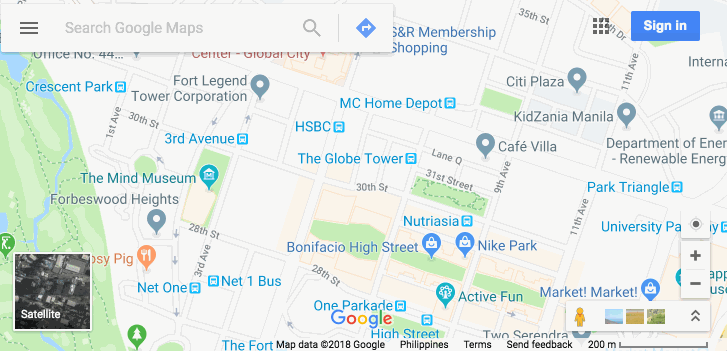
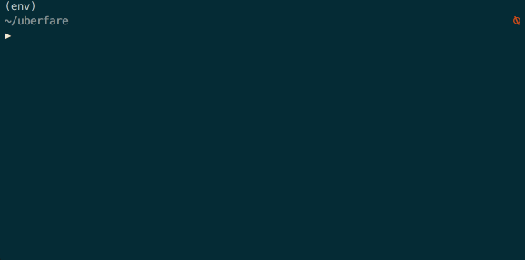

Uberfare
========

.. image:: https://img.shields.io/pypi/v/uberfare.svg
    :target: https://pypi.python.org/pypi/uberfare

.. image:: https://img.shields.io/pypi/l/uberfare.svg
    :target: https://pypi.python.org/pypi/uberfare

.. image:: https://img.shields.io/pypi/pyversions/uberfare.svg
    :target: https://pypi.python.org/pypi/uberfare

.. image:: https://travis-ci.org/BurnzZ/uberfare.svg?branch=master
    :target: https://travis-ci.org/BurnzZ/uberfare

.. image:: https://codecov.io/gh/BurnzZ/uberfare/branch/master/graph/badge.svg
    :target: https://codecov.io/gh/BurnzZ/uberfare

This is a simple wrapper to the official Uber Python SDK intended to
collect data from a given **origin** and **destination** at a specified
time interval.

The current implementation only handles the price estimate feature since
it doesn’t need OAuth 2.0 access.

Motivation
~~~~~~~~~~

I’m using this tool in order to gather data and then evaluate when’s the
best time to leave the house and book an Uber ride to work, and
vice-versa.

Requirements
~~~~~~~~~~~~

* Python 3.4+

Installation
~~~~~~~~~~~~

I'd recommend installing it via `pipenv <http://pipenv.org/>`_:

.. code-block:: bash

    $ pipenv install uberfare
    $ # or via the usual pip
    $ pip3 install uberfare

API Key
~~~~~~~

Get your ``Server Token`` API Key by creating an app at:
`developer.uber.com/dashboard <https://developer.uber.com/dashboard>`__,
and then:

* Create or Select an app
* Copy the **Server Token** value in the **Auth** page

Before using this package, export your ``Server Token`` as:
``export UBER_SERVER_TOKEN=<Server Token>``. You can however, override
this when using the CLI (see below).

Usage
~~~~~

You have to determine the ``(latitude,longitude)`` of your location,
since the types of rides available will depend on it.

The best way to get the coordinates is going to
`maps.google.com <https://www.google.com.ph/maps>`__ and then clicking
any point in the map. A small box will then appear at the bottom-center
of your screen containing the Longitude and Latitude. Take note of the
coordinates for both your origin and destination:

CLI
^^^

.. code:: bash

    >>> # To get the fare estimate, provide the arguments: <origin>, <destination>
    >>> # (Where origin and destination are in the <LATITUDE,LONGITUDE> format)
    >>> uberfare estimate 14.55,121.05 14.52,121.01

    >>> # To save all the RAW data in a CSV file, you can do:
    >>> uberfare estimate 14.55,121.05 14.52,121.01 --output-file output.csv

.. code:: bash

    >>> # You can also periodically fetch the Uber fares by using the
    >>> # --check-interval <time in seconds> flag (short -ci):
    >>> uberfare --check-interval 120 estimate 14.55,121.05 14.52,121.01
    >>> uberfare -ci 120 estimate 14.55,121.05 14.52,121.01

    >>> # To safely save the data in long periods of time, do:
    >>> uberfare --check-interval 120 estimate 14.55,121.05 14.52,121.01 --output-file output.csv

    >>> # You can override the '$UBER_SERVER_TOKEN' env variable right in the CLI via:
    >>> uberfare --server_token <SERVER API KEY> estimate 14.55,121.05 14.52,121.01
    >>> uberfare -st <SERVER API KEY> estimate 14.55,121.05 14.52,121.01

Notes
~~~~~

Be careful when specifying a very short time interval for checking the
price since you might be rate limited.

Future Releases
~~~~~~~~~~~~~~~

* Better interface for importing as a package
* Option to use address instead of coordinates (use 
  `Google Maps Geocoding API <https://developers.google.com/maps/documentation/geocoding>`_)
* Support the Upfront Fare data collection by enabling the OAUTH2.
